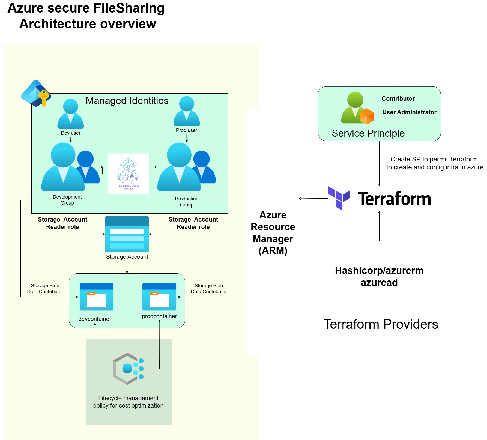

# 🔐 Secure File Sharing System for a Small Team

## 📌 Problem Statement

Small teams often need to share documents securely across departments.  
Email attachments are risky and hard to manage.  

This project replaces insecure sharing with a **secure, scalable, and cost-optimized solution using Azure Blob Storage**.

---

## ✅ Solution Overview

- **Azure Blob Storage** — Each department gets its own container.  
- **Azure AD RBAC** — Only authorized users/groups can access specific containers.  
- **Lifecycle Management** — Automatically archive or delete old files.  
- **Beginner Friendly** — No complex networking or compute; just storage, identity, and automation.

---

## 🧱 File Structure

| File | Purpose |
|------|----------|
| `provider.tf` | Defines required providers (AzureRM, AzureAD) |
| `variables.tf` | Sets location and other configurable values |
| `resourcegroup.tf` | Creates the resource group |
| `user.tf` | Creates Azure AD users |
| `adGroup.tf` | Creates AD groups and adds users |
| `storageAccount.tf` | Creates the storage account |
| `devContainer.tf` | Creates container for development team |
| `prodContainer.tf` | Creates container for production team |
| `lifecycle.tf` | Adds lifecycle rules (auto-tiering, deletion) |
| `roleAssignment.tf` | Assigns RBAC roles to teams for containers |

---

## Architecture Overview



---


## 🚀 Setup Instructions

### 🔹 Step 1: Create a Service Principal

```bash
az ad sp create-for-rbac --name "TerraformSP" --role="Owner" --scopes="/subscriptions/<sub_id>"
```
Save the output securely — you'll need the appId, password, and tenant.


### 🔹 Step 2: Assign Directory Role to Admin
To manage users and groups via Terraform, assign the User Administrator role to your SP or admin user:


```bash copy code
az role assignment create \
  --assignee <object_id_of_admin_or_sp> \
  --role "User Administrator" \
  --scope "/"

```
🔐 Required for azuread_user and azuread_group resources.

🔧 Export Azure Credentials for Terraform
Create a file named .env.sh (excluded via .gitignore) and add:

``` bash
#!/bin/bash 
export ARM_SUBSCRIPTION_ID="<your-subscription-id>"
export ARM_CLIENT_ID="<your-app-id>"
export ARM_CLIENT_SECRET="<your-client-secret>"
export ARM_TENANT_ID="<your-tenant-id>"

```
Then run:
```bash
source .env.sh
```
✅ This allows Terraform to authenticate securely using environment variables.

### 🔹 Step 3: Verify the infrastructure we are going to deploy using terraform command:

```bash
terraform plan
```

### 🔹 Step 4: Deploy infrastructure using terraform command:

```bash
terraform apply
```


📦 Uploading Files to Blob Storage
After deploying the infrastructure, upload a file to the dev container:

```bash
az storage blob upload \
  --account-name f1lesh4r3 \
  --container-name devcontainer \
  --auth-mode login \
  --name devfile \
  --file <PATH-TO-YOUR-FILE>
```

✅ Verify Upload

```bash
az storage blob list \
  --account-name f1lesh4r3 \
  --container-name devcontainer \
  --auth-mode login \
  --output table
```

---
🔐 Security Notes
Hardcoded Storage Account Name: Safe if public access is disabled and RBAC is enforced.

Avoid committing:

SAS tokens

Access keys

.env.sh or .tfvars with secrets

Use .gitignore to exclude sensitive files.

---

💡 Real-World Value
This setup replaces Google Drive/Dropbox for internal use with:

🔒 Secure access control

♻️ Automated cleanup

💰 Cost-efficient storage tiers

Perfect for small teams, interns, or cloud beginners building real-world Azure skills.

---

🙌 Author
Built by [Thiruppathi](https://github.com/thiru2612) — aspiring cloud-native engineer focused on secure, scalable infrastructure.